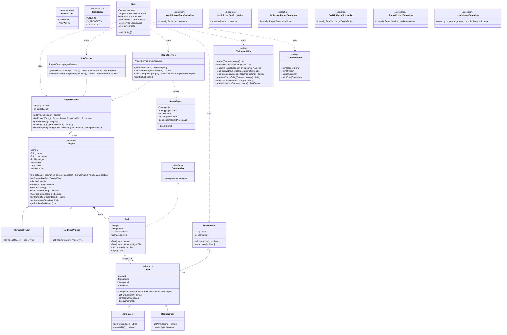

# Class Diagram Source

This is the up-to-date text description of every class in the system, current as of Phase 3
(exceptions + JUnit testing). Paste the Mermaid block below into a Claude conversation (or any
Mermaid-compatible tool) to regenerate `docs/class-diagram.png` so it reflects the current
codebase - the existing image predates `UserService`, the 6 custom exceptions, and the
`models/project` / `models/user` package split.

## What changed since the last diagram

- `Project`/`User` moved into their own packages: `models.project`, `models.user`.
- New class: `services.UserService` (storage/lookup for users, same pattern as `ProjectService`).
- `TaskService` no longer searches every project - it now takes the `Project` explicitly
  (`getTaskInProject(Project, String)`), scoped to one project.
- New package: `utils.exceptions`, with 6 custom checked exceptions.
- `enums.ProjectType` / `enums.TaskStatus` moved out of `models` into their own `enums` package.

## Mermaid diagram

## Notes for whoever regenerates the image

- Group the 6 exception classes visually off to one side (e.g. a dashed box labeled
  `utils.exceptions`) rather than interleaving them with the model/service classes - they're
  cross-cutting, not part of the main inheritance hierarchy, and cluttering the diagram with
  full exception detail obscures the actual OOP relationships (inheritance, composition,
  interface implementation) that matter more for this diagram's purpose.
- The three inheritance pairs to make visually obvious: `Project → SoftwareProject/HardwareProject`,
  `User → AdminUser/RegularUser`, and the interface implementation `Task ..|> Completable`.
- `Project *-- Task` should read as composition (filled diamond) - tasks live and die with their
  project. `ProjectService o-- Project` / `UserService o-- User` should read as aggregation
  (hollow diamond) - the service holds references but doesn't own their lifecycle the same way.
